# 简介
此篇文章内容浅显，针对于未接触过git的小白。 
该篇文章将简单的介绍如何通过git来上传自己的代码至github，如何进行分支开发，以及如何克隆github中的代码到本地。
# 第一步
[下载git](https://git-scm.com/downloads) 
[注册github账号](https://github.com/)
# 第二步 （在github中建立仓库）
 
登录github，点击右上方头像，展开如下菜单，并点击Your profile，进入个人主页。

选择并点击上方的Respositories便可进入仓库,点击右侧绿色的按钮`new`进行新建仓库.

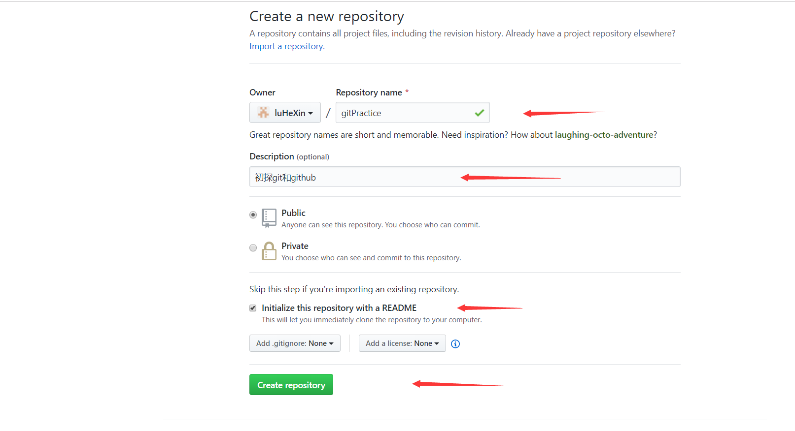

添加必要信息之后点击Create Respositories之后便可便成功创建了一个仓库。

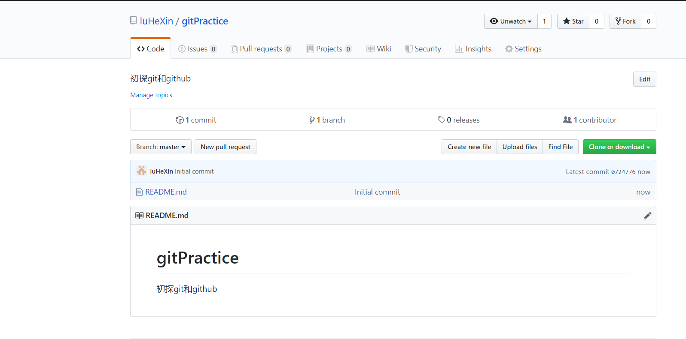

如上图，仓库创建成功。

# 第三步（创建SSH）
点击右上角头像，展开目录后，点击setting进入设置页面。

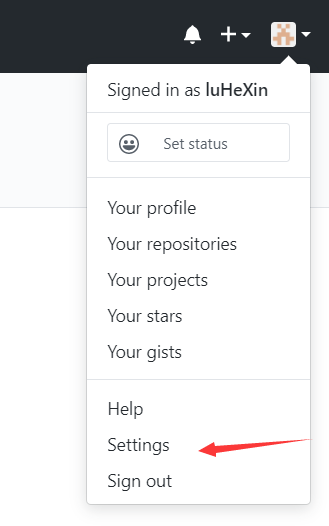

点击左侧`SSH and GPG keys`,再点击`new ssh key`。

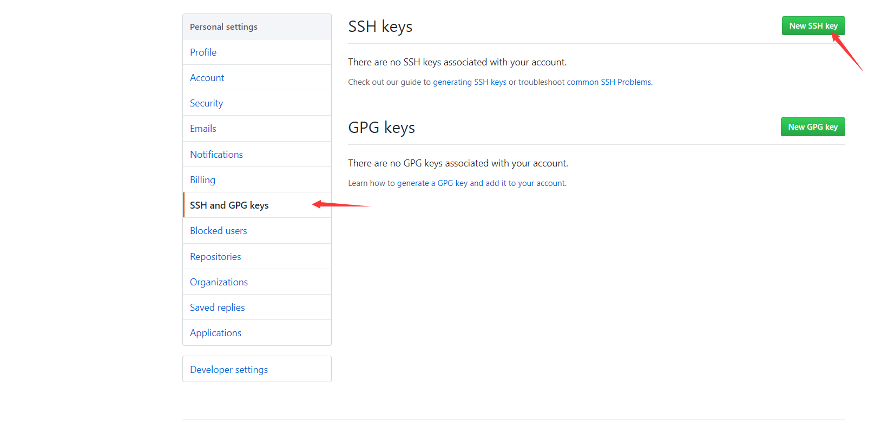

这时他需要填`Title`和`key` Title一栏可以随意填写，
而key一栏我们则需要手动获取。

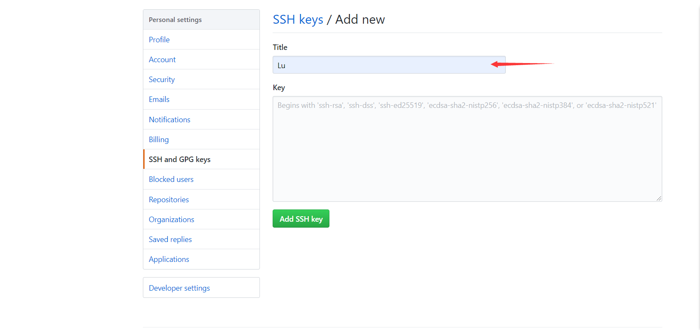

回到桌面，鼠标右键，选择`git bash here`，打开git命令栏窗口。 
输入`ssh-keygen`点击回车,
便会出现如下路径（路径汇银因客户端的不同而不同）。

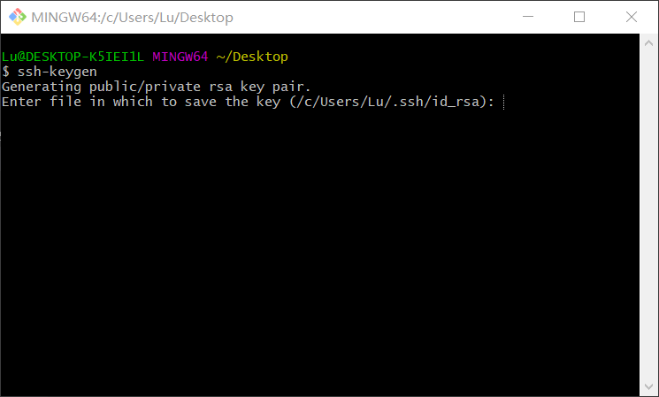

按此路径找到`id_rsa.pub`文件，打开方式选择以记事本方式打开，这里的内容便是`key`栏中需要填写的内容，复制以下内容，粘贴到`key`一栏即可。

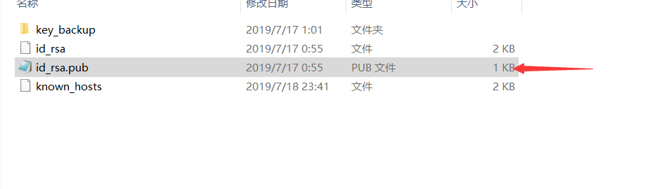

重新回到仓库界面，点击clone or down，使用ssh，并复制一下这个链接

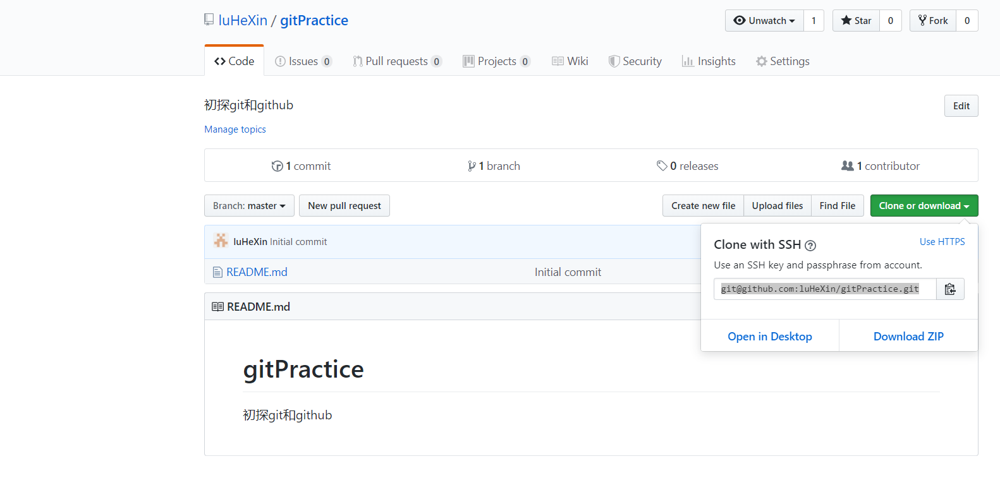

# 第四步 （复制代码至本地）
在任意位置创建一个空文件夹（文件夹名字随意），打开文件夹后，鼠标右键,选择`git bash here`，打开git命令栏窗口。 
输入指令`git clone + 粘贴刚才复制的那一段链接`，并回车，如下图所示

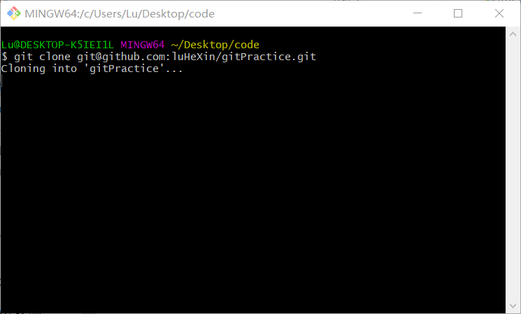

回到文件夹中，便看到原本空文件夹里多出了一个文件夹，此文件夹便是github中的文件。

# 第五步（1） （将代码推到github）
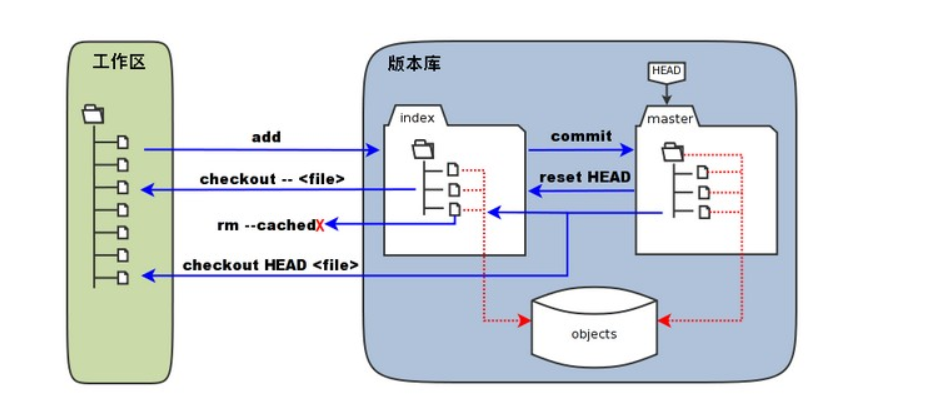
这是git推送文件的流程
- 工作区：便是本地电脑中可以看到的目录
- 暂存区：一般存放在 ".git目录下" 下的index文件（.git/index）中
- 版本库：工作区的一个隐藏目录.git（是Git的版本库）。

1. 我们打开上一步中克隆的文件夹，新建一个文件1.txt

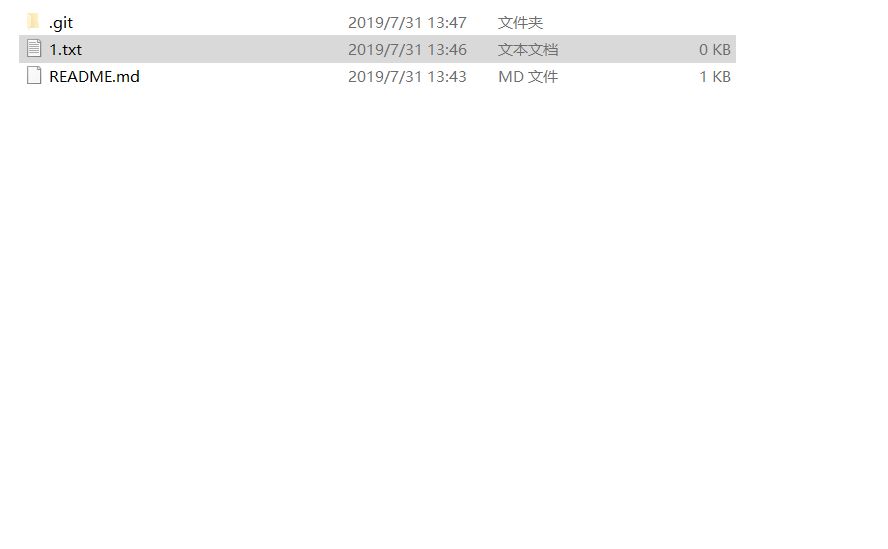

2. 鼠标右键,选择`git bash here`
输入指令`git add .` 并回车，将文件添加到版本区。
(这里的 ` . `代表该目录下所有文件至版本区也可以单独添加1.txt文件`git add 1.txt`)
3. 继续输入指令`git commit -m "update"`（双引号里的内容是提交到github中的文件描述，所以双引号里的内容任意）
4. 最后输入指令`git push `将文件推到远端。
回到仓库刷新后，便可看到提交的文件

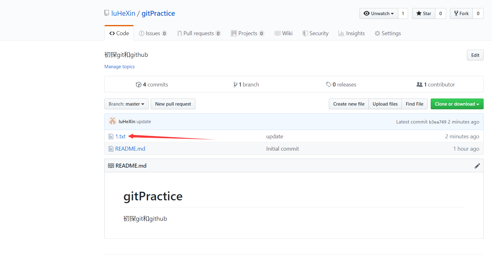

# 第五步（2） （将代码推到github）
（若读者是已经进行了第四步与第五步（2）可以先不进行本步骤操作） 
上一步是在复制代码至本地的基础上进行的，若没进行第四步的操作，直接将代码推到github上则需 
- 新建需推到远端的文件如1.txt.
- 在文件夹中打开git命令窗口，输入`git init`进行初始化，此时系统会自动创建.git隐藏文件。
- 回到github仓库，先复制https链接，接着在命令窗口输入
`git remote add origin 复制好的链接`  
`git pull origin master` ，进行刷新 
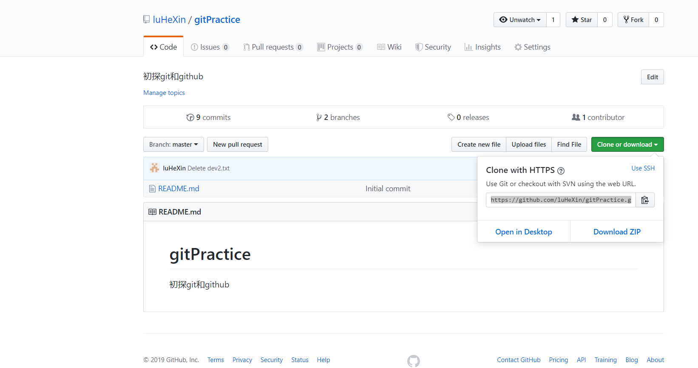
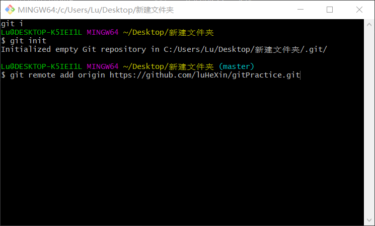

接着我们就可以进行提交操作

- `git add .`  
- `git commi -m "dev"` 

由于这是初始化后的第一次推到远端，所以我们指出推到的分支，即输入如下命令，将文件推到`master`分支上
- `git push origin master` 

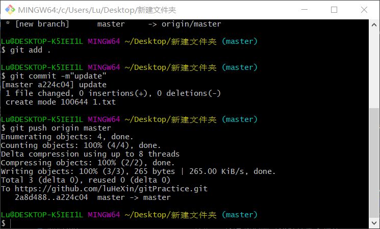

# 删除提交的文件

可以直接在github上进行可视化的编辑，点击要删除的文件名，进入该文件在github中的文件属性页，进行如下图操作。 
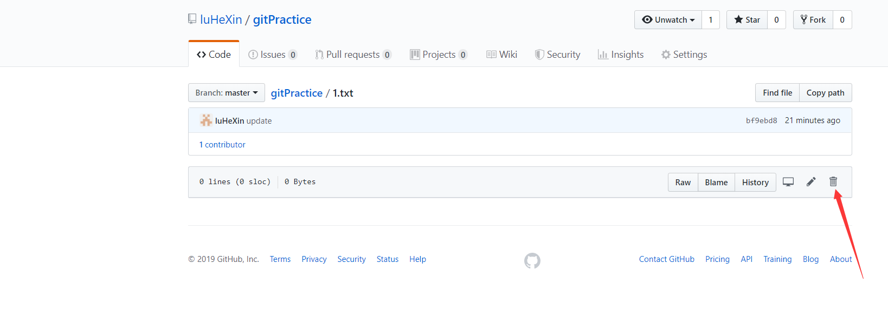
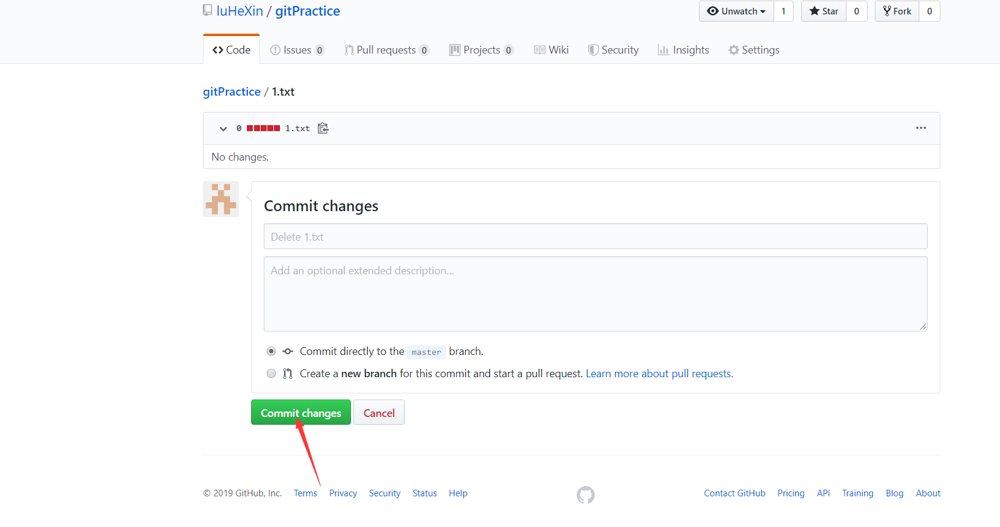

# 分支开发

1. 依旧在文件夹中打开git命令行窗口。 
由于我们在远端github上执行了删除命令的操作，导致远端的文件与本地文件不同，这时便需要在命令行窗口输入指令`git pull` 并回车，进行刷新操作。 
（有时在不确定远端是否更改时也可以通过`git pull`指令来进行刷新） 
2. 刷新之后，通过指令`git branch dev`并回车，创建分支（dev是创建的分支名，在这里也可以随意命名分支）。
3. `git checkout dev`并回车,便切换到了dev分支。
4. 在文件夹中创建文件`dev.txt`
5. 提交分支文件， 
`git add .`  
`git commi -m "dev"` 
`git push` 

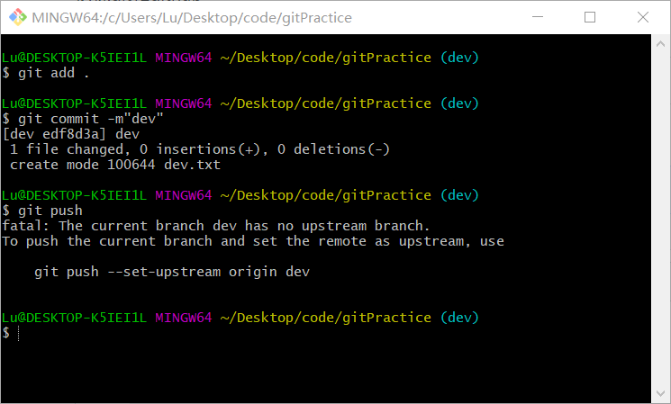

此时由于是第一次在该分支提交文件，`git push`指令并没有是文件提交到远端，此时根据提示输入 
`git push --set-upstream origin dev`回车后，待push完毕后便可看到仓库中多了一个分支，分支中的文件便是刚提交的文件。（只有dev分支有dev.txt文件）
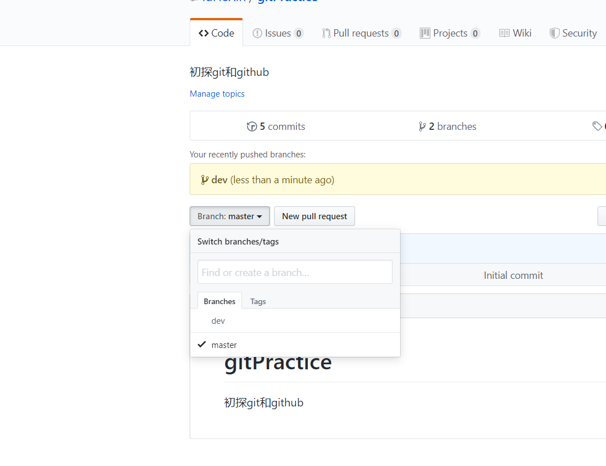
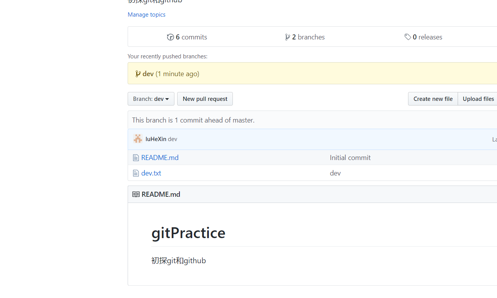

6. 后续提交

返回文件夹新建`dev2.txt`文件
提交分支文件， 
`git add .`  
`git commi -m "dev"` 
`git push` 

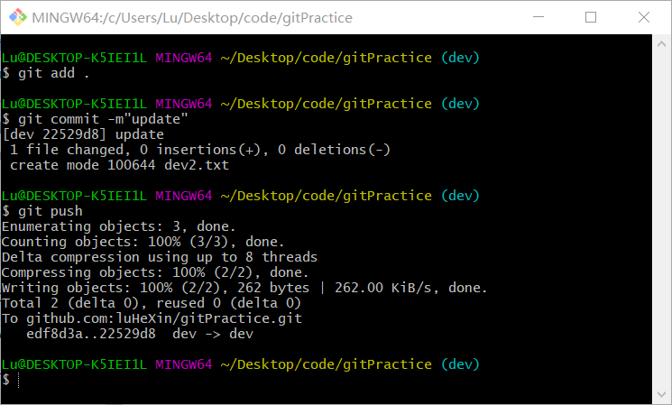

此时发现不需输入指令`git push --set-upstream origin dev`便可提交到github中，其实，只有在切换分支后以及git的初始化后的第一次提交会提示需要在添加此指令，在以后的push过程中并不需要添加此指令。 
在github中查看，`dev2.txt`已上传完毕

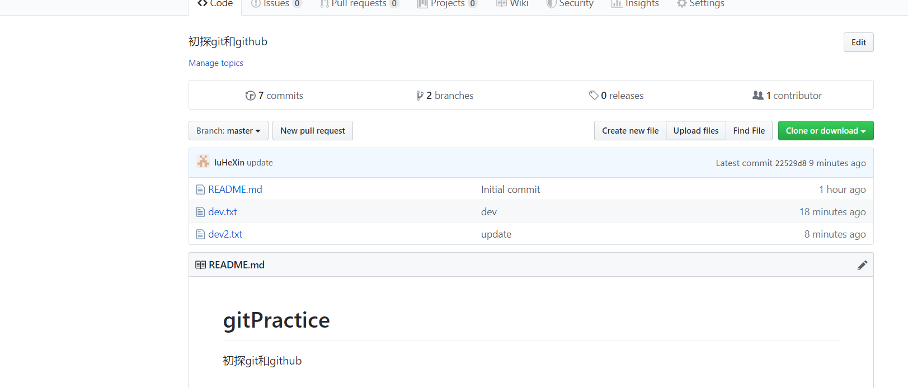

7. 合并dev分支至master

`git checkout master `切换到主分支 
`git pull`刷新 
` git merge dev`合并请求 
`git push`推到github上 
回到仓库，切换到master分支，这时发现master分支多出了dev.txt和dev2.txt两个原本在dev分支上的文件。此时便说明分支合并成功了。 
值得注意的是，我们如今已切换到了master分支。若想将文件提交到刚刚的dev分支上则需先 
通过指令`git checkout dev `切换会dev分支，再进行陆续操作。

# 参考文章：
https://www.runoob.com/git/git-workspace-index-repo.html

